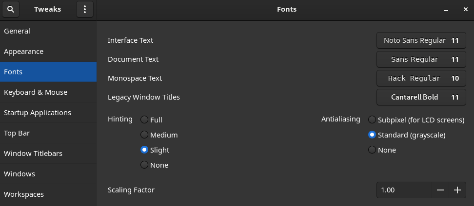

# Archlinux installation process

In this guide I describe the installation steps, packages and settings that I usually use on my
personal laptop.

## Create bootleable pendrive

Download the current ISO from [here](https://archlinux.org/download/) and create a bootable pendrive with the following command:

```bash
sudo dd bs=4M if=archlinux-<release_date>-x86_64.iso of=/dev/<pendrive> status=progress oflag=sync
```
Replace `release_date` with the proper relase date and `pendrive` with the mapped device.

## Installation from scratch

### Boot the pendrive

On most Dell laptops, you can choose this option by pressing *F12* key at boot time.

### Update the system clock

Use `timedatectl` to ensure the system clock is accurate by enabling NTP:

```bash
timedatectl set-ntp true
```

### Partition and format the disk

In my case I use `fdisk` but you can use `parted`. 

```bash
fdisk /dev/the_disk_to_be_partitioned
```

Use GTP partition table if your laptop support it. Three partition will be enought to
install Arch Linux:

- EFI: Type 1 - `EFI System` formated with FAT32. 512 MiB is enough.
- root: Type 20 - `Linux Filesystem` formated with ext4
- swap: Type 19 - `Linux Swap`. Swap size should be at least the size of RAM to support hibernation.


Once the partitions have been created, format the partitions with the appropriate file system:

```bash
mkfs.fat -F 32 /dev/efi_partition
mkfs.ext4 /dev/root_partition
mkswap /dev/swap_partition
```

### Mount the file systems

Mount the root partition to `/mnt`:

```bash
mount /dev/root_partition /mnt
```

Create the **efi** mount point:

```bash
mkdir /mnt/efi
mount /dev/efi_partition /mnt/efi
```

Enable the swap partition:

```bash
swapon /dev/swap_partition
```

### Essential packages installation

Check the list of mirror servers that the live system has in `/etc/pacman.d/mirrorlist`. By default it comes with a list generated by
[reflector](https://wiki.archlinux.org/title/Reflector). You can edit this list and move the geographically closest mirrors to the top of the list.

In my case I use:

```bash
reflector -c 'United States' -c Canada --latest 5 --protocol https --save /etc/pacman.d/mirrorlist
```

Use the pacstrap script to install the base package:

```bash
pacstrap /mnt base linux linux-firmware
```

### Configure the system

1) Generate the `fstab` file:

```bash
genfstab -U /mnt >> /mnt/etc/fstab
```

2) Chroot into the new system:

```bash
arch-chroot /mnt
```

3) Set the timezone:

```bash
ln -sf /usr/share/zoneinfo/America/Argentina/Cordoba /etc/localtime
```

4) Generate the `/etc/adjtime` file:

```bash
hwclock --systohc
```

5) Edit `/etc/locale.gen`, uncomment `en_US.UTF-8 UTF-8` and other needed locales, and execute:

```bash
locale-gen
```

6) Create the `locale.conf` file with:

```bash
echo "LANG=en_US.UTF-8" > /etc/locale.conf
```

7) Set the keyboard layout:

```bash 
echo "KEYMAP=us" > /etc/vconsole.conf
```

8) Set the hostname:

```bash
echo myhostname > /etc/hostname
```

9) Add matching entries to the `/etc/hosts` file:

```bash
127.0.0.1	localhost
::1		    localhost
127.0.1.1	myhostname.localdomain	myhostname
```

10) Create a new initramfs:

```
mkinitcpio -P
```

11) Set the root password:

```
passwd root
```

12) Install a boot loader (in my case GRUB) and microcode:

```bash
pacman -S grub efibootmgr os-prober intel-ucode 
grub-install --target=x86_64-efi --efi-directory=/efi --bootloader-id=arch_grub
grub-mkconfig -o /boot/grub/grub.cfg
```

13) Exit the chroot environment, umount mounted partitions and reboot.

14) Setup the network interface to have access to the Internet. I set it manually by using `iproute2`.

15) Install `sudo` package, create a user and add it to the `wheel` group:

```bash
pacman -S sudo
useradd -m -c "Ary Kleinerman" -s /bin/bash ary
passwd ary
gpasswd -a ary wheel
```

16) Edit the `/etc/sudoers` file and uncomment the group `wheel`.

### Install basic packages

Install the following basic packages:

```bash
pacman -Syu
pacman -S openssh \
      bash-completion \
	  nvim \
	  man-db \
	  man-pages \
	  base-devel \
	  git \
	  htop \
	  bind-tools \
	  tcpdump \
	  reflector \
	  tmux \
	  zsh \
	  zsh-completions \
	  zsh-autosuggestions \
	  zsh-syntax-highlighting \
	  colordiff \
	  python-virtualenv \
	  python-pip \
	  ipython \
	  docker \
	  docker-compose \
	  cups \
	  ntfs-3g \
	  fzf \
	  fd \
	  ripgrep 
```

### Mirror List

Generate a good mirror list file (`/etc/pacman.d/mirrorlist`) by using the online
[generator](https://www.archlinux.org/mirrorlist/) or using `reflector`:

```bash
sudo reflector -c 'United States' -c Canada --latest 5 --protocol https --save /etc/pacman.d/mirrorlist
sudo pacman -Syu
```

### Colored pacman

Uncomment the `Color` line in `/etc/pacman.conf`.

### Docker and docker-compose

Install the following packages:

```bash
sudo pacman -S docker docker-compose
sudo usermod -aG docker <user>
```

### Colordiff

To have colorized files according to the extension, generate `/etc/DIR_COLORS` with:

```bash
dircolors -p | sudo tee /etc/DIR_COLORS
```

## Installing Gnome

Install the following packages:

```bash
pacman -S gnome gnome-extra \
          networkmanager \
	  bluez-utils \
	  gnome-tweak-tool
```

*Note: as I usually do these tasks thru an SSH session, I use tmux.*

After Gnome is installed, enable the following services:

```bash
systemctl enable gdm
systemctl enable NetworkManager
systemctl enable bluetooth
```

Enable **H.264** for Gnome videos:

```bash
sudo pacman -S gst-libav
```

### NetworkManager setup with systemd-resolved**

1) Remove `/etc/resolv.conf`.

2) Enable `systemd-resolved.service` to work with NetworkManager:

```bash
systemctl enable systemd-resolved.service
```

3) Create the file `/etc/NetworkManager/conf.d/dns.conf` with:

```bash
[main]
dns=systemd-resolved
```

4) Make `/etc/resolv.conf` to be a symlink to `/run/systemd/resolve/stub-resolv.conf`:

```bash
ln -sf /run/systemd/resolve/stub-resolv.conf /etc/resolv.conf
```

5) Reboot.

### Gnome extensions

To manage Gnome extensions from Firefox, install `chrome-gnome-shell` from the AUR.
These are the extensions that I usually use:

- AppIndicator and KStatusNotifierItem Support (this extension needs `libappindicator-gtk3`).
- Frippery Move Clock.
- Gnome 40 UI Improvements.
- Dash to Dock ➜ from AUR `gnome-shell-extension-dash-to-dock`.

### LibreOffice

Install Libre Office package and the spelling corrector:

```bash
sudo pacman -S libreoffice-still
sudo pacman -S hunspell-es_ar
sudo pacman -S hunspell-en_US
```

### Extra packages

I usually install the following packages after installing Gnome:

- google-chrome (AUR)
- chrome-gnome-shell (AUR)
- firefox
- kitty
- zsh-theme-powerlevel10k-git (AUR)
- kubectl
- libreoffice-still
- dropbox (AUR) - you need to execute `gpg --recv-keys 1C61A2656FB57B7E4DE0F4C1FC918B335044912E`
before installing `dropbox` package and install `python-gpgme`.
- nautilus-dropbox (AUR)
- slack-desktop (AUR)
- teamviewer (AUR)
- zoom
- visual-studio-code-bin (AUR)
- gimp
- obs-studio

### Fonts

Install the following packages and configure them thru the `Gnome Tweaks tool`:

- ttf-dejavu
- ttf-hack
- ttf-liberation
- ttf-opensans
- noto-fonts
- noto-fonts-emoji
- nerd-fonts-dejavu-complete (AUR)
- nerd-fonts-noto-sans-mono (AUR)



### Icons

Install `papirus-icon-theme` and enable it thru the `Gnome Tweak Tool`.

### Keyboard

To have accents in your English keyboard, go to **Settings** ➜ **Keyboard** and add **English (intl., with AltGr dead keys)** to the Input Sources.

### Firefox

Installing a dictionary add-on will add a new language option to your spell-checker, which
checks your spelling as you type in [Firefox](https://addons.mozilla.org/en-us/firefox/language-tools/)

## Hardware video acceleration

Hardware video acceleration makes it possible for the video card to decode/encode video, thus offloading the CPU and saving power.

Install the following packages:

```bash
pacman -S libva-utils libva-intel-driver
```

More info [here](https://wiki.archlinux.org/title/Hardware_video_acceleration)

## Pipewire

Pipewire is a new low-level multimedia framework. It aims to offer capture and playback for both audio and video with minimal
latency and support for PulseAudio, JACK, ALSA and GStreamer-based applications. It replaces PlulseAudio. I'm not sure if a new
Gnome fresh install comes with it. You can check it with

```bash
$ pactl info
```
  
If it says `Server Name: PulseAudio (on PipeWire 0.3.32)` it means it's already installed.

**Install Pipewire (Optional)**

Install `pipewire` package and also install `pipewire-alsa`, `pipewire-jack`, `pipewire-media-session`,`pipewire-pulse`.

```bash
$ sudo pacman -S pipewire pipewire-{alsa,jack,media-session,pulse}
```

Reboot and check with `pactl info`.

`pipewire-pulse` will replace `pulseaudio` and `pulseaudio-bluetooth`.

Execute `systemctl status --user pipewire-pulse.service` to see the effect.

## Respecting the regulatory domain

To configure the regdomain, install `crda` package, edit `/etc/conf.d/wireless-regdom` and uncommenting the appropriate domain,
then reboot and check with:

```bash
sudo pacman -S crda
sudo sed -i 's/^#\(.*\)\("US"\)/\1\2/' /etc/conf.d/wireless-regdom
```

Reboot and check:

```bash
iw reg get
```
