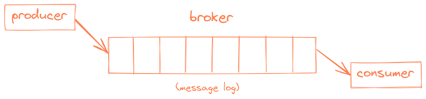
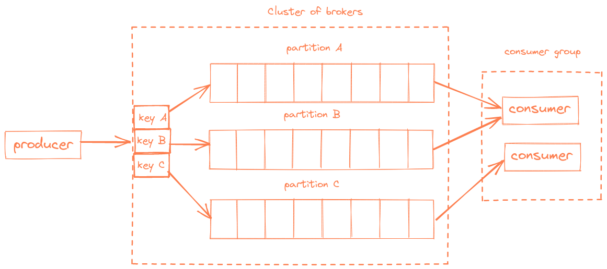
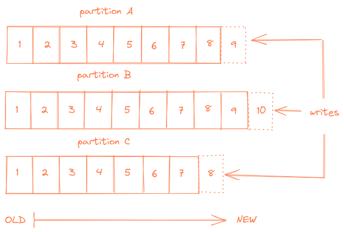
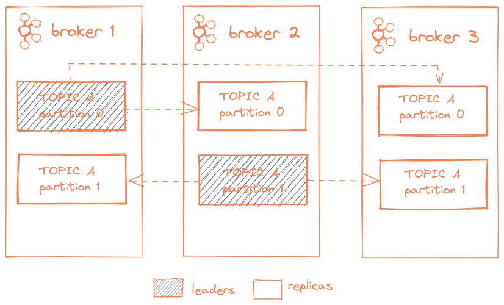

# Kafka for dummies

Apache Kafka is a distributed, horizontally scalable streaming platform. Kafka is based on the pub/sub model. It's
similar to any messaging system. Applications (`producers`) send messages (`records`) to a Kafka node (broker) and
messages are processed by other applications called `consumers`. Messages are stored in `topics` and consumers can
subscribe to a topic and listen to those messages. Topics are split into `partitions` of data.
user actions, etc.

Summarizing, producers publish messages to a topic, the broker stores them in the received order, and consumers
subscribe and read messages from the topic.

Messages (records) are stored as serialized bytes and consumers are responsible for de-serializing the messages.
Messages can have any format, the most common are JSON and Avro.

Messages always have a key-value structure; a key or value can be null. If the producer doesn't indicate where to write
the data, the broker uses the key to partition and replicate messages. When the key is null, messages are distributed
using the round-robin distribution.

Topic partitions contain an ordered set of messages and each message in the partition has a unique offset. Kafka
doesn't track which messages were read by a task or consumer. Consumers must track their own location within each log.
By default Kafka retains messages for seven days. The retention setting is configured per topic.

## Partitions

As described above, Kafka stores data within topics. Topics are split into partitions. A partition is an ordered,
immutable log of records that is continually appended to. Each record in a partition is assigned a sequential
identification number called offset, that uniquely identifies the record within the partition. A topic is made up of
one or more partitions.

Splitting topics into multiple partitions provides multiple benefits:

- Logs can scale larger than the size of one server; each partition must fit within the size of one server but a topic
with multiple partitions can spread across many servers.
- Consumption of topics can be parallelized by having a consumer for each partition of a topic.

## Distribution and reliability within Kafka

Each broker holds a set of partitions where each partition is either a leader or a replica for a given topic. All
writes to and reads from a topic happen through the leader. The leader coordinates updates to replicas when new records
are appended to a topic. If a leader fails, a replica takes over as a new leader. Additionally, a replica is said to be
in-sync if all data has been replicated from the leader. By default, only in-sync replicas can become a leader if the
leader fails. Out-of-sync replicas can be a sign of broker failure or problems within Kafka.

## Producing to Kafka

Producers publish to topics of their choosing and they are responsible for assigning a partition to the record within the topic they
are producing to. This can be done in a round-robin fashion to balance it or according to a semantic partition function (such as based on a key within the record).

## Consuming from Kafka

Consumers in Kafka are organized into `consumer groups`. A consumer group is a set of consumer instances that share group id and
consume data from partitions in a topic.

When a topic is consumed by consumers in the same group, every record will be delivered to only one consumer. As the official
documentation states: "If all the consumer instances have the same consumer group, then the records will effectively be load-balanced 
over the consumer instances."

This way you can ensure parallel processing of records from a topic and be sure that your consumers won't be stepping on each other
toes.
